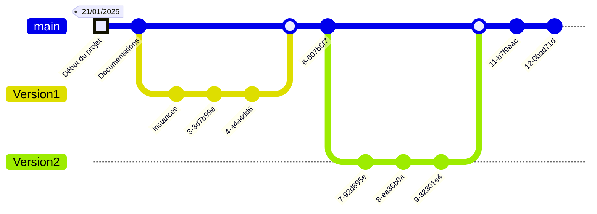
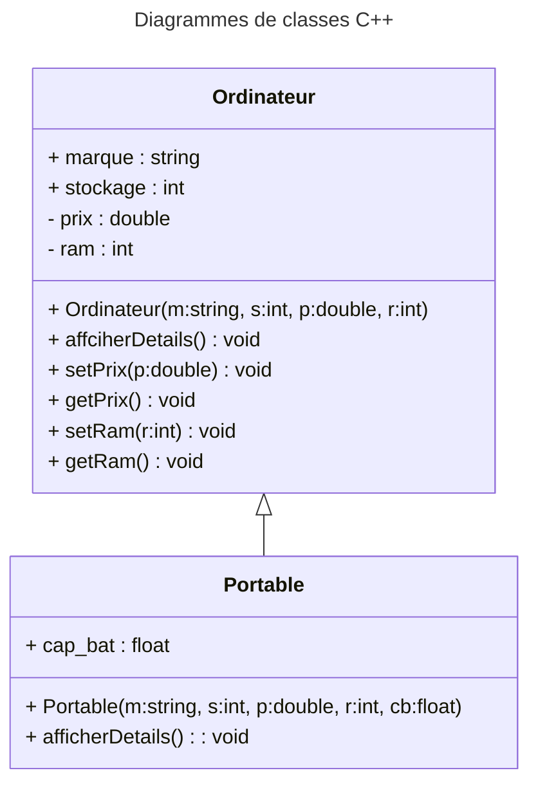

# Utilisation de Gitgraph

---
Gestion du versionning : GTB
---

```mermaid
gitGraph
    commit id: "Début du projet" type: HIGHLIGHT tag: "21/01/2025 "
    commit id: "Documentations"
    branch Version1
    commit id: "Instances"
    checkout Version1
    commit
    commit
    checkout main
    merge Version1
    commit
    branch Version2
    commit
    commit
    commit
    checkout Version2
    checkout main
    merge Version2
    commit
    commit
```

```mermaid

---
title: Diagrammes de classes C++
---
classDiagram
Ordinateur <|-- Portable
class Ordinateur{
    + marque : string
    + stockage : int
    - prix : double
    - ram : int
    + Ordinateur(m:string, s:int, p:double, r:int)
    + affciherDetails() void
    + setPrix(p:double) void
    + getPrix() void
    + setRam(r:int) void
    + getRam() void
    }

    class Portable{
        + cap_bat : float

        + Portable(m:string, s:int, p:double, r:int, cb:float)
        + afficherDetails() : void
    }

```